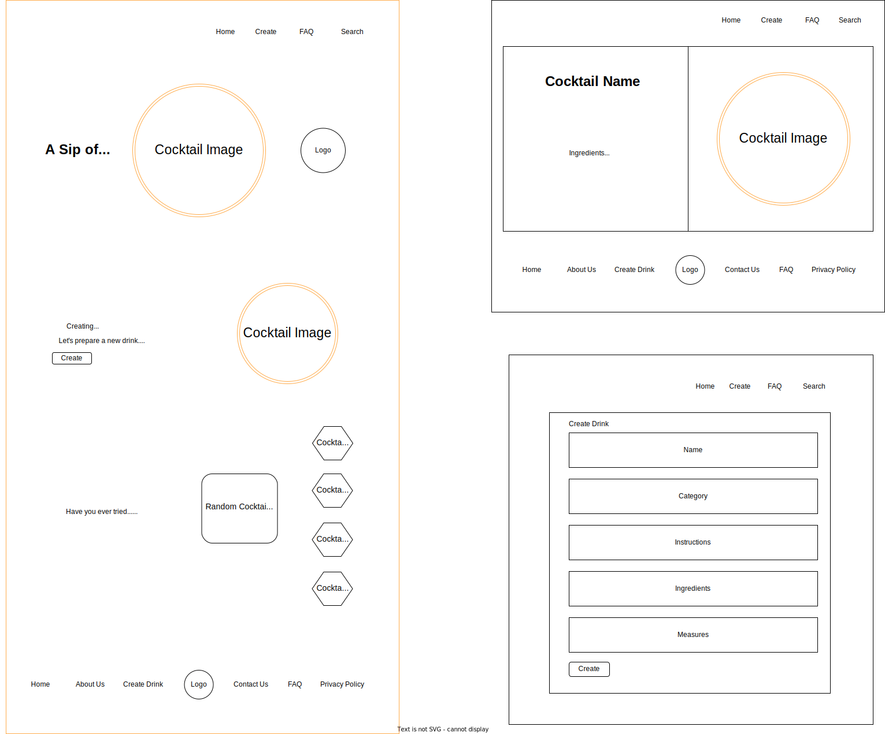
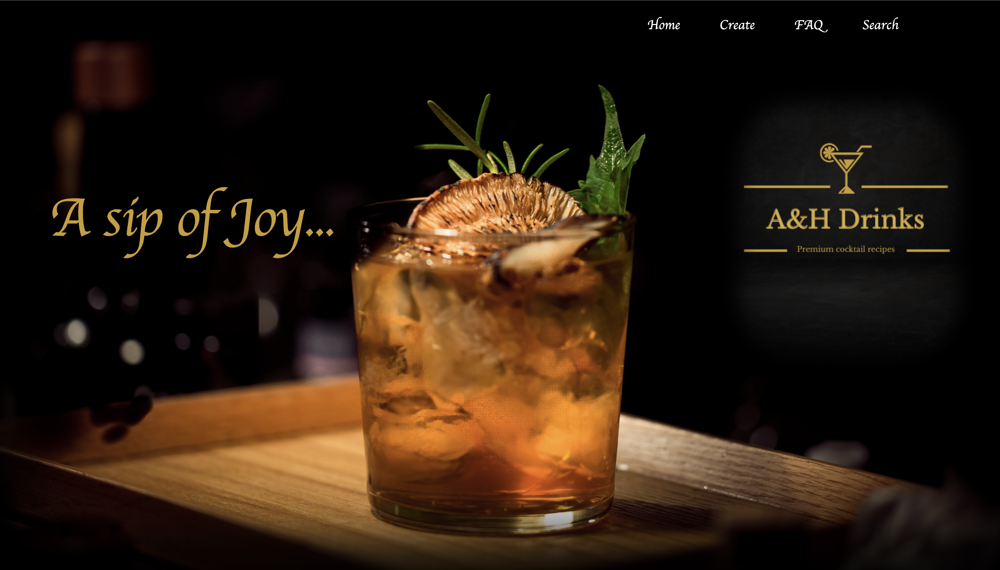
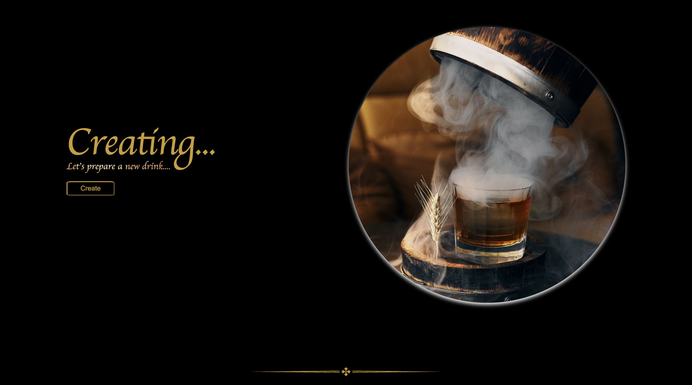
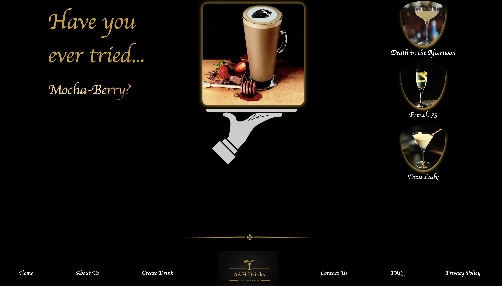
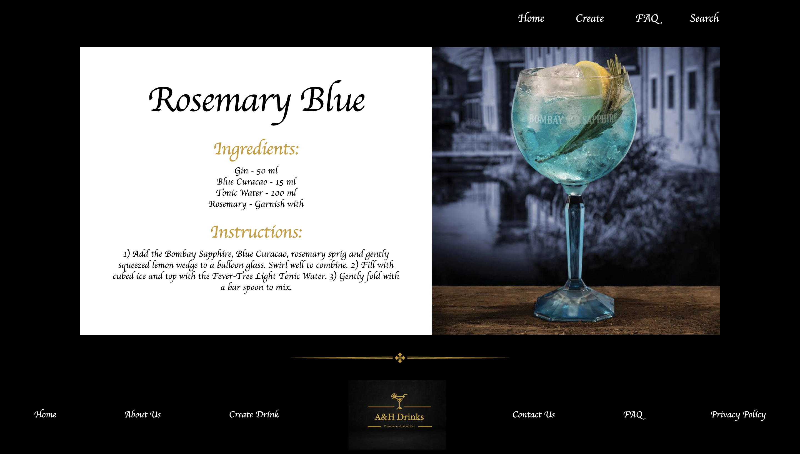

# CocktailApp

This project is about a fictional cocktail's brand app that gives access to several recipies and allows the user to create his own drink, edit and delete it.

Generated with [Angular CLI] version 15.0.1.

## Wireframe

## Technologies Used
- Angular
- NgRx
- Json Server
- Typescript
- HTML
- CSS

## Components and Pages structure
Homepage Component:
- Intro section
- Create Drink section
- Cocktails-list section
- Footer 

Item Component:
- Image and details

Creation Component:
- Form 

Edit Component:
- Form & detail card

Nav-Bar Component
Foooter Component

404 Page

## Home-page

## Detail-page

## 404-Page

## Development server

Run `ng serve` for a dev server. Navigate to `http://localhost:4200/`. The application will automatically reload if you change any of the source files.

## Code scaffolding

Run `ng generate component component-name` to generate a new component. You can also use `ng generate directive|pipe|service|class|guard|interface|enum|module`.

